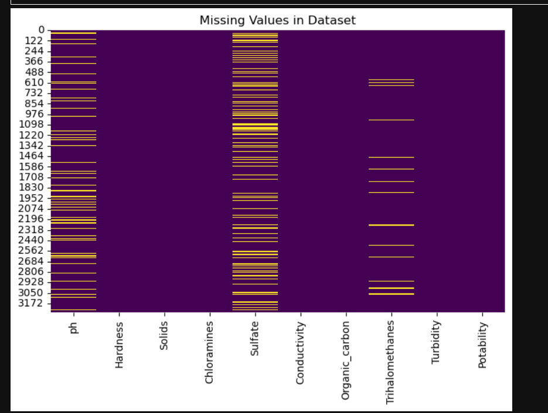
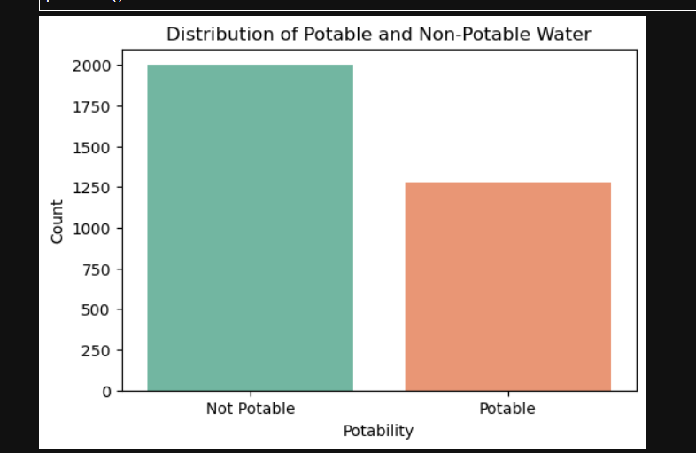
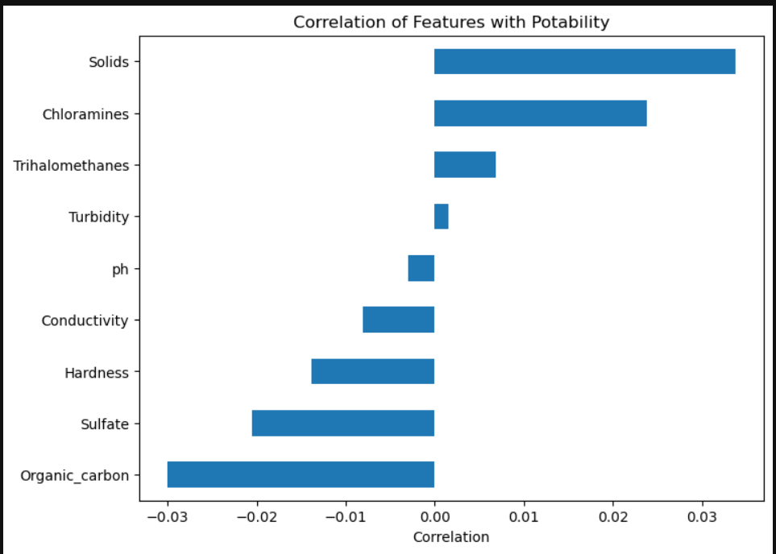
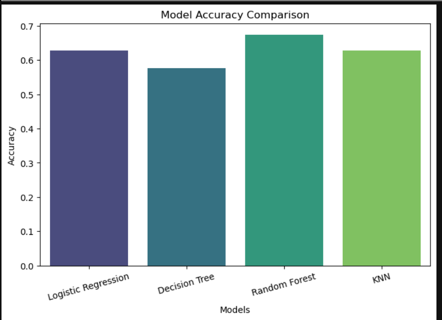

# Water Potability Prediction

## Overview

This project predicts whether water is safe to drink using Machine Learning classification algorithms.

## Dataset

- Water Potability Dataset
- 3276 samples
- 9 input features
- 1 target variable (Potability)

## Algorithms Used

- Logistic Regression
- Decision Tree
- Random Forest
- KNN

## Workflow

1. Data Collection
2. Data Cleaning
3. Exploratory Data Analysis
4. Feature Scaling
5. Train-Test Split
6. Model Training
7. Model Evaluation
8. Model Comparison

## Technologies

- Python
- Pandas
- NumPy
- Matplotlib
- Seaborn
- Scikit-learn
- Jupyter Notebook

## Results

The models were compared using accuracy, and the best-performing model was selected for prediction.

## Null Values

The visualization shows the exsiting null values.

---

### Class Distribution

The graph shows the number of potable and non-potable water samples for checking if the data is imbalanced or not.

---

### Correlation Heatmap

The heatmap represents the correlation among all water quality features.

---

## Model Comparison

Random Forest achieved the highest accuracy among all the trained models.

---

